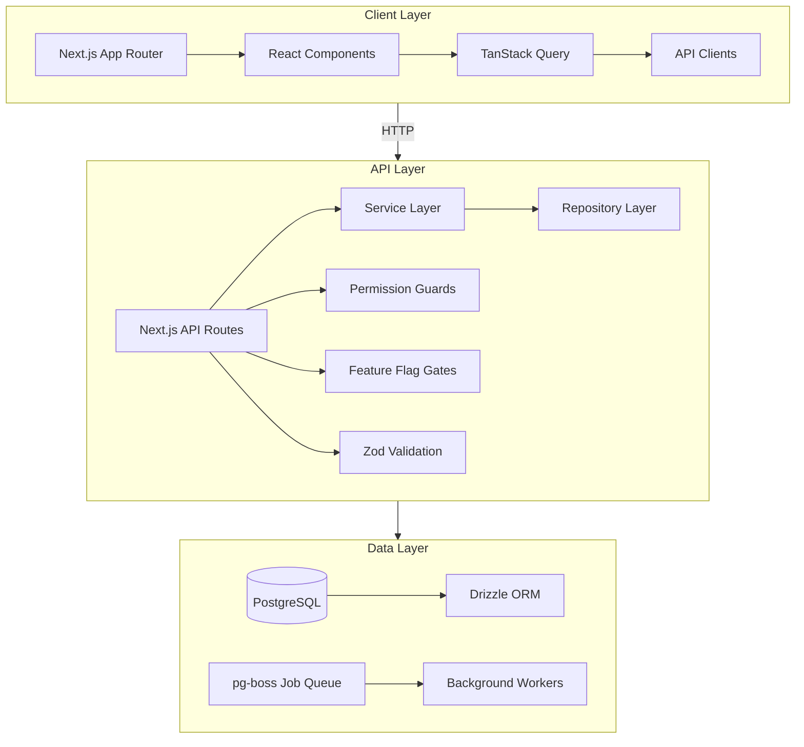
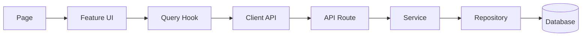
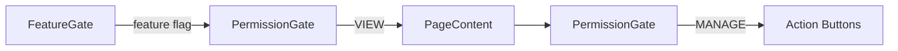
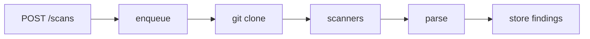

# Architecture Overview

## System Architecture



## Data Flow



| Layer | Location | Responsibility |
|-------|----------|---------------|
| Page | `app/**/page.tsx` | Compose features, fetch data |
| Feature UI | `features/*/` | Render UI, handle interactions |
| Query Hook | `modules/*/queries.ts` | TanStack Query cache layer |
| Client API | `modules/*/api.ts` | HTTP calls to API routes |
| API Route | `app/api/v1/**/` | Validate input, call service |
| Service | `server/modules/*/services/` | Business logic orchestration |
| Repository | `server/modules/*/repositories/` | Database queries (Drizzle) |
| Database | PostgreSQL | Data persistence |

## Directory Structure

```
src/
├── app/            # Next.js App Router — routing & layouts only
├── features/       # UI feature modules (components, hooks, state)
├── modules/        # Client-side data modules (API clients, queries)
├── server/         # Backend logic (services, repositories, schemas)
├── commons/        # Shared UI components, constants, types, schemas
├── lib/            # Third-party integrations (drizzle, redis, queue)
├── utils/          # Pure helper functions
└── config/         # App configuration & env validation
```

## Key Design Decisions

### 1. Server/Client Separation

Server modules (`server/`) are never imported from client code. Client data access goes through API routes via `modules/api.ts`.

### 2. Feature Module Pattern

Each feature is self-contained:

```
features/
└── scan/
    ├── ScanTable.tsx
    ├── ScanDetailDrawer.tsx
    ├── ScanTimeline.tsx
    ├── NewScanModal.tsx
    ├── FindingItem.tsx
    ├── types.ts          # Feature-specific types
    └── index.ts          # Public API exports
```

### 3. Permission-First UI

Every page uses a layered guard system:



### 4. Queue-Based Scan Processing

Scans are processed asynchronously via pg-boss:



## Database Schema

44 tables organized by domain:

| Domain | Tables |
|--------|--------|
| Auth | users, accounts, sessions, verification_tokens |
| Workspaces | workspaces, workspace_members, invitations |
| Projects | projects, project_members, project_api_tokens |
| Repositories | repositories, source_controls, source_control_repos |
| Scans | scans, scan_results, scan_uploads, schedules |
| Findings | findings, finding_groups, finding_history, comments |
| AI | ai_verifications, models, model_presets |
| Knowledge | knowledge_base_entries, knowledge_sources |
| Quality | quality_gates, quality_gate_results |
| Teams | teams, team_members |
| Audit | audit_logs, activity_logs, notifications |
| Webhooks | webhooks, webhook_deliveries |
