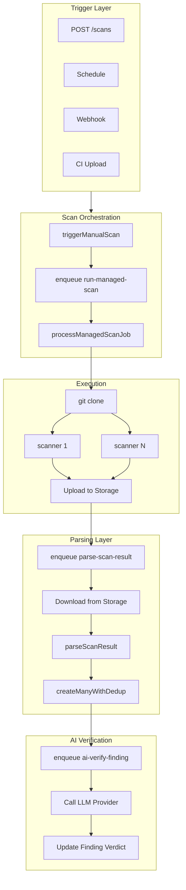
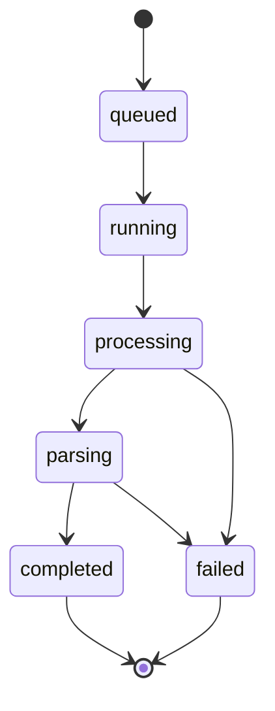
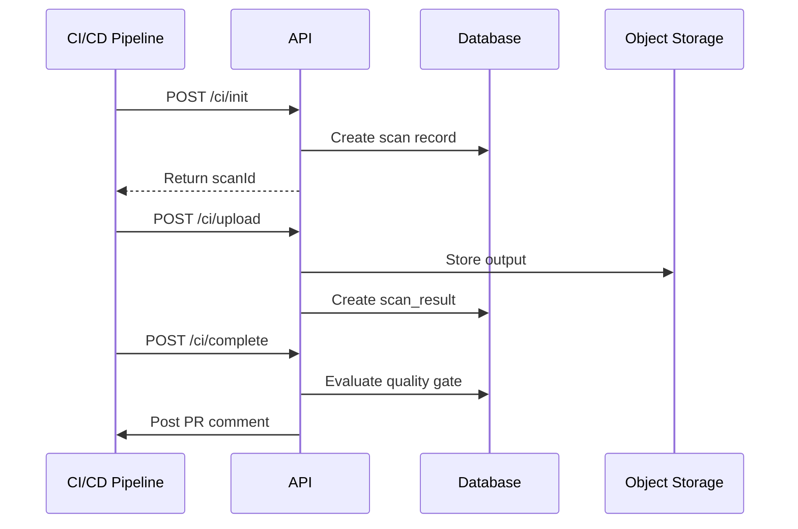

# Scan Pipeline

## Overview

The scan pipeline handles the complete lifecycle from scan trigger to finding storage.

## Pipeline Architecture



## Scan Lifecycle

### Status Flow



| Status | Description |
|--------|-------------|
| `queued` | Enqueued to pg-boss worker |
| `running` | Worker picked up job |
| `processing` | Scanners executing in parallel |
| `parsing` | Scanner output being parsed |
| `completed` | All parse jobs finished |
| `failed` | One or more scanners/parse jobs failed |

### Timeline Events

Each scan generates a timeline with these event types:

| Event | Description |
|-------|-------------|
| `triggered` | Scan initiated |
| `queued` | Waiting for worker |
| `cloning` | Git clone in progress |
| `scanning` | Scanner execution |
| `parsing` | Output parsing |
| `ai_verifying` | AI verification |
| `completed` | Scan finished |
| `failed` | Scan failed |
| `skipped` | Scanner skipped (not installed) |

## Managed Scan Execution

### `triggerManualScan(input)`

```typescript
interface TriggerManagedScanInput {
  workspaceId: string;
  projectId?: string;
  repositoryId: string;
  userId: string;
  branch?: string;          // Default: repository's default_branch
  scanners?: ScannerId[];   // Default: ['semgrep', 'gitleaks']
  triggerSource?: 'manual' | 'schedule' | 'webhook';
}
```

### `processManagedScanJob(data)`

1. Set status to `processing`
2. `git clone --depth 1 --branch {branch} {url}`
3. For each scanner:
   - Check availability
   - Run scanner CLI
   - Upload output to storage
   - Create `scan_result` record
   - Enqueue `parse-scan-result` job
4. If ALL scanners failed → throw error
5. Set status to `completed`
6. Cleanup temp directory

## CI/CD Upload Flow

For external CI/CD pipelines:



## Scanner Output Parsers

| Scanner | Format | Parser |
|---------|--------|--------|
| semgrep | JSON | `parseSemgrep()` |
| gitleaks | JSON | `parseGitleaks()` |
| flawfinder | SARIF | `parseSarif()` |
| cppcheck | XML | `parseCppcheck()` |
| clang-tidy | Text | `parseClangTidy()` |
| gcc-fanalyzer | Text | `parseGCCFanalyzer()` |

## Queue Jobs

| Job | Handler | Description |
|-----|---------|-------------|
| `run-managed-scan` | `processRunManagedScanJob` | Clone repo, run scanners |
| `parse-scan-result` | `processParseScanResultJob` | Parse output, create findings |
| `ai-verify-finding` | `processAiVerifyFindingJob` | AI verification |
| `trigger-scheduled-managed-scan` | Scheduled scan trigger |
| `cleanup-old-scan-files` | Retention cleanup |
| `nvd-knowledge-backfill` | NVD CVE data import |
| `sync-source-control` | SCM token refresh |
| `scan-timeout-watchdog` | Detect orphaned scans (>30min) |
